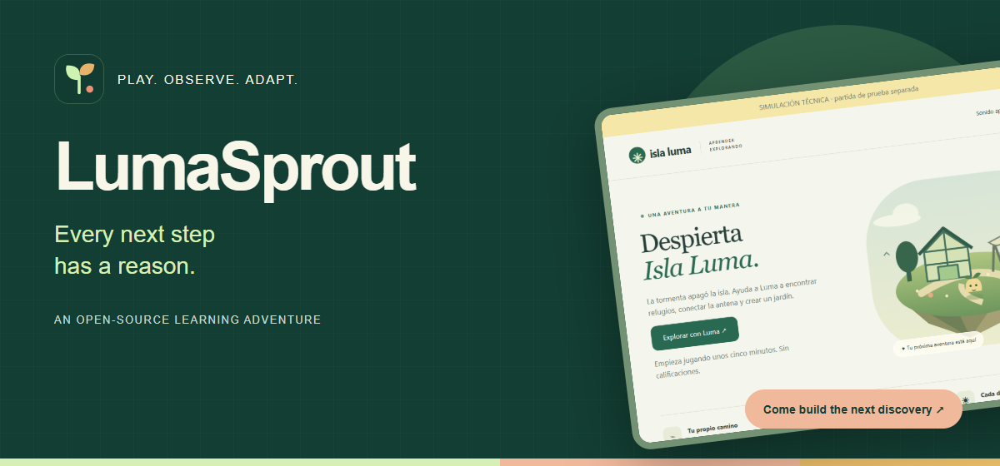
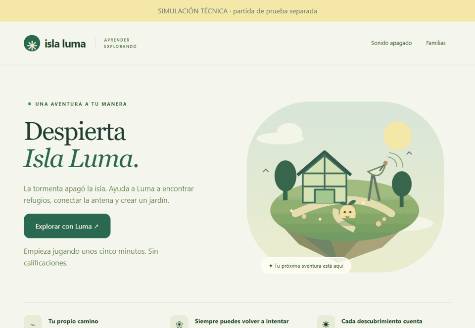
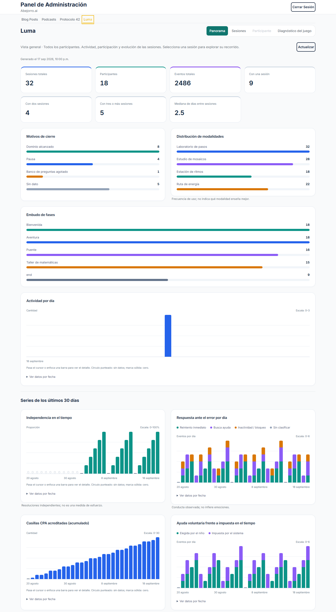
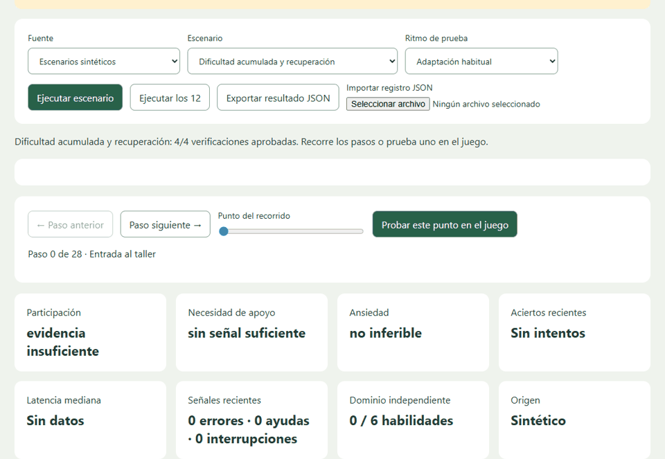
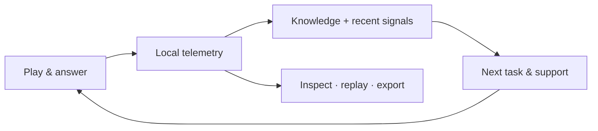

<p align="center"></p>

<p align="center">
  <a href="https://cristhianvs.github.io/lumasprout/">Explore the demo</a> ·
  <a href="CONTRIBUTING.md">Build with us</a> ·
  <a href="docs/ROADMAP.md">Roadmap</a> ·
  <a href="docs/README.es.md">Español</a>
</p>
<p align="center">
  <a href="https://github.com/cristhianvs/lumasprout/actions/workflows/ci.yml"></a>
  <a href="LICENSE"></a>
  
  
</p>

## A little island. Many ways to learn.

**LumaSprout is a learning adventure with an inspectable feedback loop.** Explore Isla Luma, work with fractions, ask for help, and see why the next activity changes. Every decision can be traced back to the interaction that informed it.

We’re building for curious learners **and** curious developers: plain JavaScript, a readable adaptation engine, browser-local telemetry and reproducible simulations. The current game is in Spanish and focuses on fractions for grades 5–6 in Mexico.

<p align="center"></p>
<p align="center"><sub>Edited sequence of actual Playwright interactions. <a href="assets/media/workshop.png">View a still image.</a></sub></p>

## New in v0.3.0

**From local evidence to an optional remote observation workflow.** The game still runs without an account or backend. This release adds a guarded telemetry client, publishes the Luma dashboard/API integration source, and includes a child-friendly feedback questionnaire.

<p align="center"></p>
<p align="center"><sub>Dashboard integration preview · Synthetic data · Requires a configured host API, not included in the hosted static demo.</sub></p>

**[Remote telemetry](docs/TELEMETRY.md)** · **[Dashboard & API source](integrations/abejorro/README.md)** · **[Child questionnaire](docs/questionnaires/README.md)** · **[Release notes](CHANGELOG.md)**

## What makes it worth building?

| Experience | Under the hood |
|---|---|
| **Four ways to play** — ordered steps, mosaics, rhythms and exploration. | One common math bank; explicit choices override provisional preferences. |
| **Support that can step back.** | Concrete → pictorial → abstract → contextual tasks, with independent opportunities after help. |
| **A pace with room to breathe.** | Pauses, reading self-report and blocks closed at task boundaries. |
| **An open feedback loop.** | Signals → rule → adaptation → response, linked through event IDs. |
| **A small stack you can understand.** | HTML, CSS and JavaScript. No application packages, API keys or backend required. |

## Try it in a minute

Use **Node.js 22.13 or newer**:

```sh
git clone https://github.com/cristhianvs/lumasprout.git
cd lumasprout
npm start
```

Open **http://127.0.0.1:4173** for the game or **http://127.0.0.1:4173/admin.html** for the simulation lab. There is no `npm install` step for the application.

The [hosted demo](https://cristhianvs.github.io/lumasprout/) opens a separate simulation save. The demo keeps gameplay in that browser and never uploads simulation events. Optional remote transport for non-simulated runs is off by default; see the [configuration and limitations](docs/TELEMETRY.md). GitHub hosts the public site and serves its assets. Export is an explicit action in **Familias → Registro y adaptación**. Use a separate browser profile for another learner.

## Open the feedback loop

<p align="center"></p>
<p align="center"><sub>Synthetic lab replay. <a href="assets/media/dashboard.png">Static dashboard preview.</a></sub></p>



The model estimates knowledge per skill. Only the first unassisted attempt updates that estimate. Assistance and retries do not certify independent progress. For new saves, completion also requires evidence across four pedagogical stages. Existing progress is preserved without inventing retrospective evidence.

## Tested technically. Ready for thoughtful contributions.

The **17 September 2026** validation snapshot includes **36 complete Playwright journeys** across four modalities and nine behaviors, plus **67 additional checks**. It produced **15,467 events** and **856 mathematical attempts**. These are synthetic scenarios, not child participants or proof of learning effectiveness. [Evidence, reproduction and limitations →](docs/EVIDENCE.md)

Preferences remain provisional. The system does not diagnose anxiety or claim that a preferred modality improves learning. Teacher review, external assessments and an observed pilot are still ahead.

```sh
npm test                       # Node engine / flow / pedagogy checks
python -m pip install -r requirements-dev.txt
# Install Google Chrome before running these browser suites.
npm start                      # Keep running in another terminal
npm run test:browser
npm run test:profiles
npm run test:pedagogy
npm run test:lab
python tests/behavior_matrix.py --profile visual
```

Generated traces and telemetry go to ignored `output/` folders. Never attach real participant exports to public issues.

## Your next meaningful commit

We’re looking for people who enjoy making learning more understandable.

| Bring your craft | Start here |
|---|---|
| JavaScript & testing | Broaden fraction generators; improve portable browser coverage. |
| Accessibility & UX | Review keyboard focus, mobile controls, reading and reduced motion. |
| Learning design | Review instructions, prerequisites and transfer problems. |
| Data & research | Strengthen telemetry contracts and independent evaluation protocols. |
| Language & community | Help separate interface strings and prepare an English game translation. |

**[Choose a starter task](docs/ROADMAP.md#starter-tasks)**, read the [contribution guide](CONTRIBUTING.md), then open an issue describing the slice you want to tackle. Small, well-explained contributions are welcome. Spanish and English are both welcome.

## Map of the project

```text
engine.js       Knowledge, signals, task bank and pedagogical progression
app.js          Adventure, interactions, local persistence and event capture
admin.*         Read-only monitoring, imports and simulation controls
simulation.js   Deterministic synthetic scenarios
tests/          Node tests and real-browser Playwright journeys
site/           Public project landing page
assets/         Original brand graphics and actual app captures
scripts/        Public demo build and marketing capture tools
docs/           Architecture, evidence, roadmap and research boundaries
```

Build the public site with `npm run build:site`; the curated `dist/` contains the landing page and game, not telemetry exports or private working documents. [Architecture →](docs/ARCHITECTURE.md)

## License & credit

Original project code and original marketing assets are released under the [MIT license](LICENSE). Research PDFs and third-party material are not redistributed or relicensed here. See [asset provenance](assets/README.md).

Created by [Cristhian Velazco](https://github.com/cristhianvs). **Help grow the next discovery.**

[Version history / Historial de versiones — v0.2.0](CHANGELOG.md)
